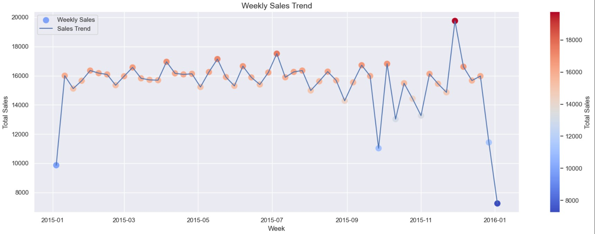
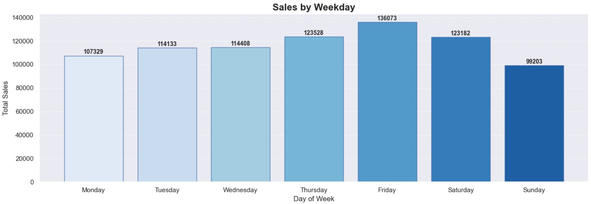
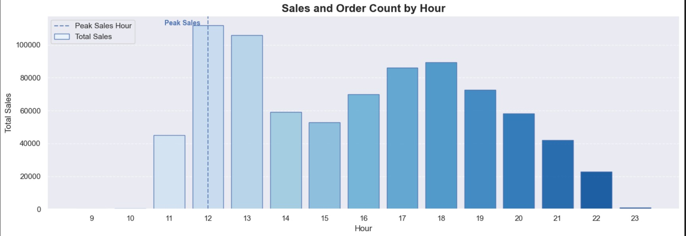
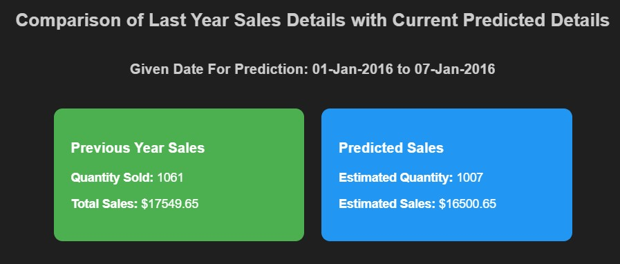

# Dominos - Predictive Purchase Order System

## Project Overview
This project aims to optimize Dominos' ingredient ordering process by predicting future sales and generating purchase orders. By leveraging historical sales data and ingredient information, we developed a predictive model to ensure optimal stock levels, minimize waste, and prevent stockouts.

---

## Achievements
1. **Sales Forecasting**: 
    - Successfully predicted future sales for individual pizza types using advanced machine learning models.
    - Models used: SARIMA, Prophet, and XGBoost.

2. **Model Selection**:
    - Automated model selection for each pizza type based on the best MAPE (Mean Absolute Percentage Error) score.
    - Ensured accurate predictions for pizzas with varying data availability.

3. **Inventory Optimization**:
    - Generated detailed ingredient requirements for predicted sales.
    - Minimized waste by aligning ingredient orders with forecasted demand.

4. **Data Insights**:
    - Conducted extensive Exploratory Data Analysis (EDA) to uncover sales trends, peak hours, and popular pizza categories.
    - Identified outliers and optimized data for better model performance.

5. **Visualization**:
    - Created insightful visualizations to understand sales trends, weekly and monthly patterns, and ingredient requirements.

6. **Exported Results**:
    - Exported predictions and ingredient requirements to an Excel file for easy access and operational use.

---

## Metrics and Insights

### Model Performance
- **Best Models**:
  - SARIMA, Prophet, and XGBoost were evaluated for each pizza type.
  - The best model for each pizza type was selected based on the lowest MAPE score.
- **MAPE Scores**:
  - Example: `Pizza ID: big_meat_s, Best Model: Prophet, Best MAPE Score: 5.2%`

### Sales Trends
- **Weekly Sales**:
  - Identified peak sales days and weekly patterns.
  - 

- **Monthly Sales**:
  - Observed seasonal trends in monthly sales.
  - 

- **Week Day Sales**:
  - Observed Week day trends in weekly sales.
  - 

- **Hourly Sales**:
  - Determined peak sales hours for better staffing and inventory planning.
  - 

### Ingredient Requirements
- Predicted ingredient quantities required for the next 7 days.
- Ensured alignment with predicted sales to avoid overstocking or shortages.

### Comparison with Previous Year
- **Previous Year Sales**:
  - Quantity Sold: `1061`
  - Total Sales: `$17549.65`
- **Predicted Sales**:
  - Estimated Quantity: `1007`
  - Estimated Sales: `$16500.65`
- 

---

## How to Use
1. **Run the Notebook**:
    - Follow the steps in the Jupyter Notebook to preprocess data, train models, and generate predictions.
2. **Export Results**:
    - Predictions and ingredient requirements are exported to `Predicted_Data.xlsx`.
3. **Visualize Insights**:
    - Use the visualizations to understand sales trends and optimize operations.

---

## Conclusion
This project demonstrates the power of predictive analytics in optimizing inventory management and sales forecasting. By leveraging advanced machine learning models and data-driven insights, Dominos can streamline its supply chain, reduce costs, and enhance customer satisfaction.

## Acknowledgments
- Special thanks to the Dominos team for providing the data and domain expertise.
- Libraries used: `pandas`, `numpy`, `matplotlib`, `seaborn`, `prophet`, `xgboost`, `pmdarima`, `scikit-learn`.

---
